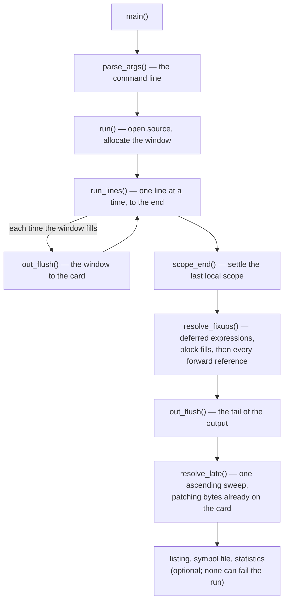
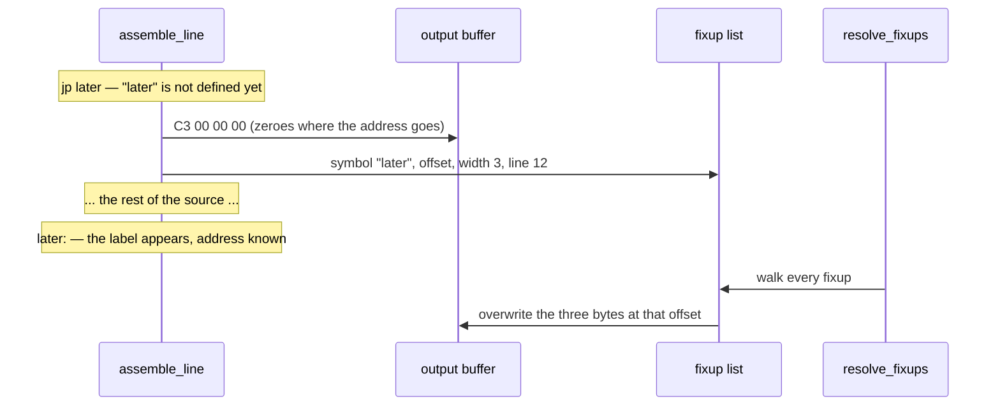
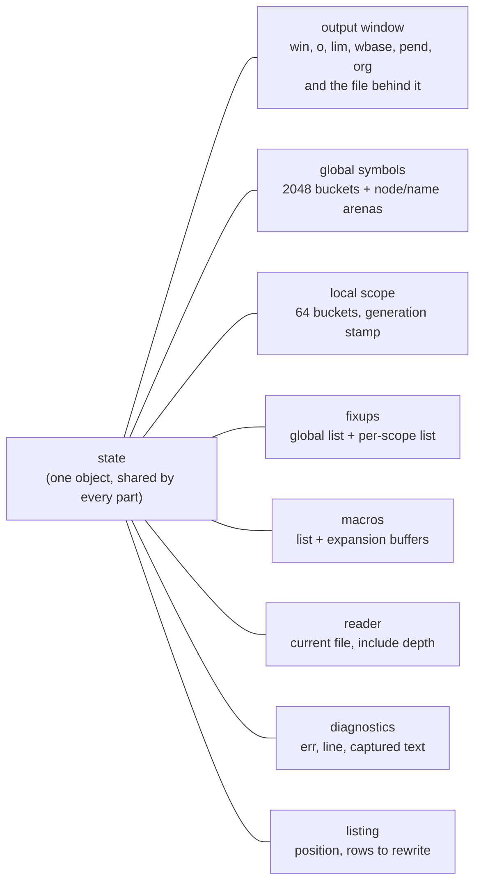
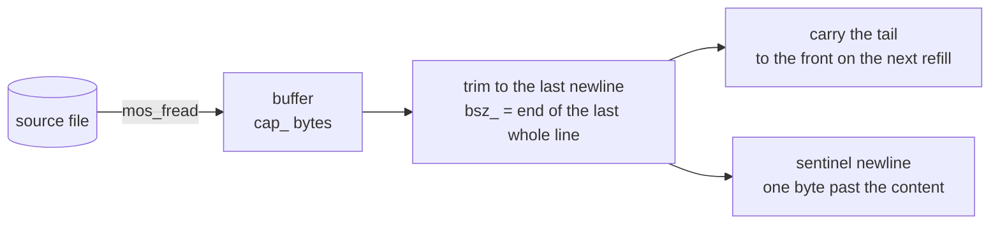
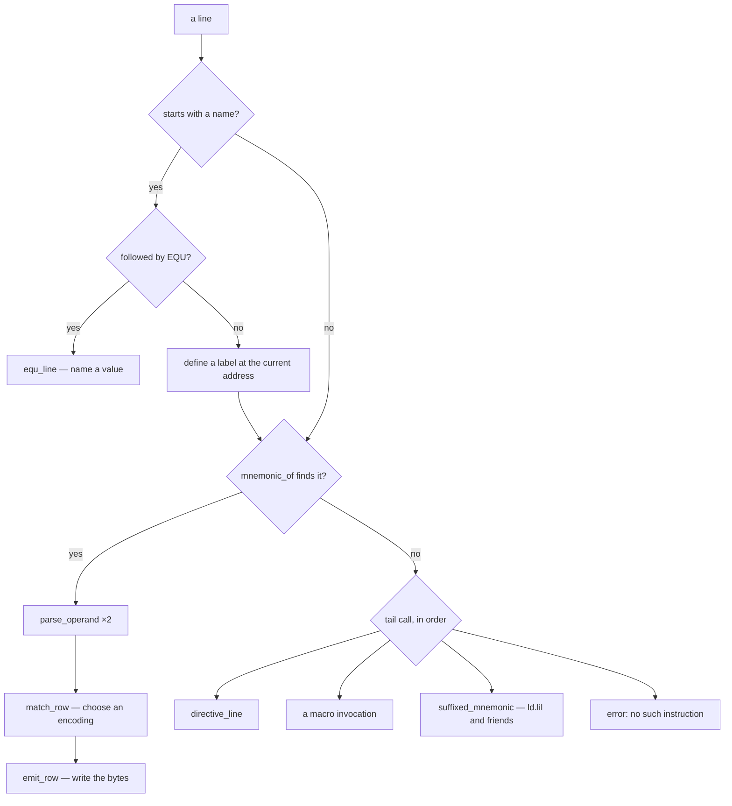
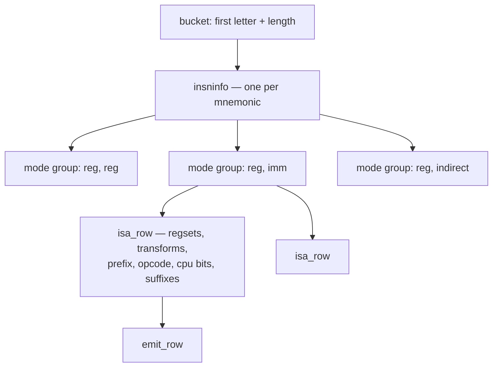
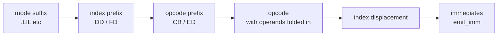
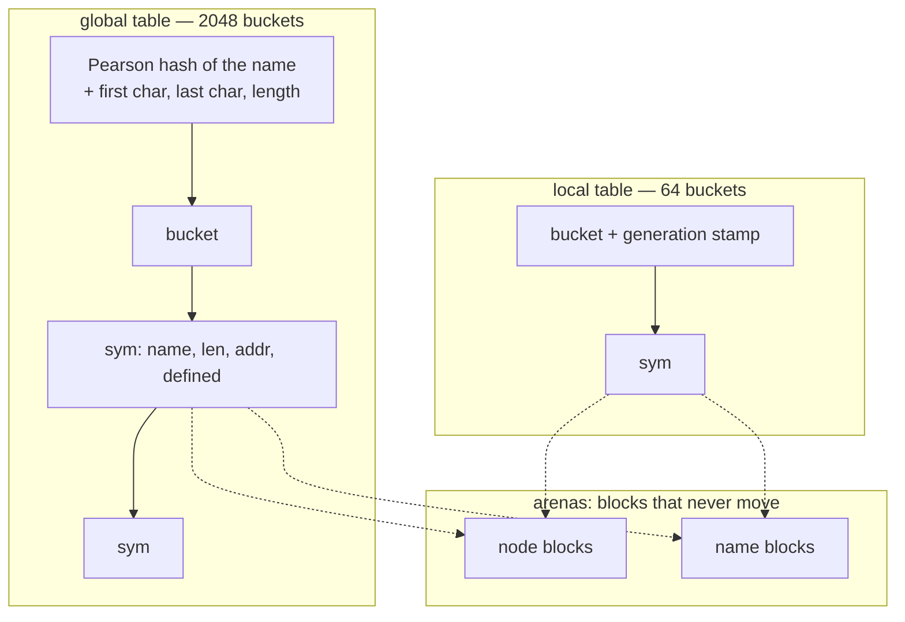
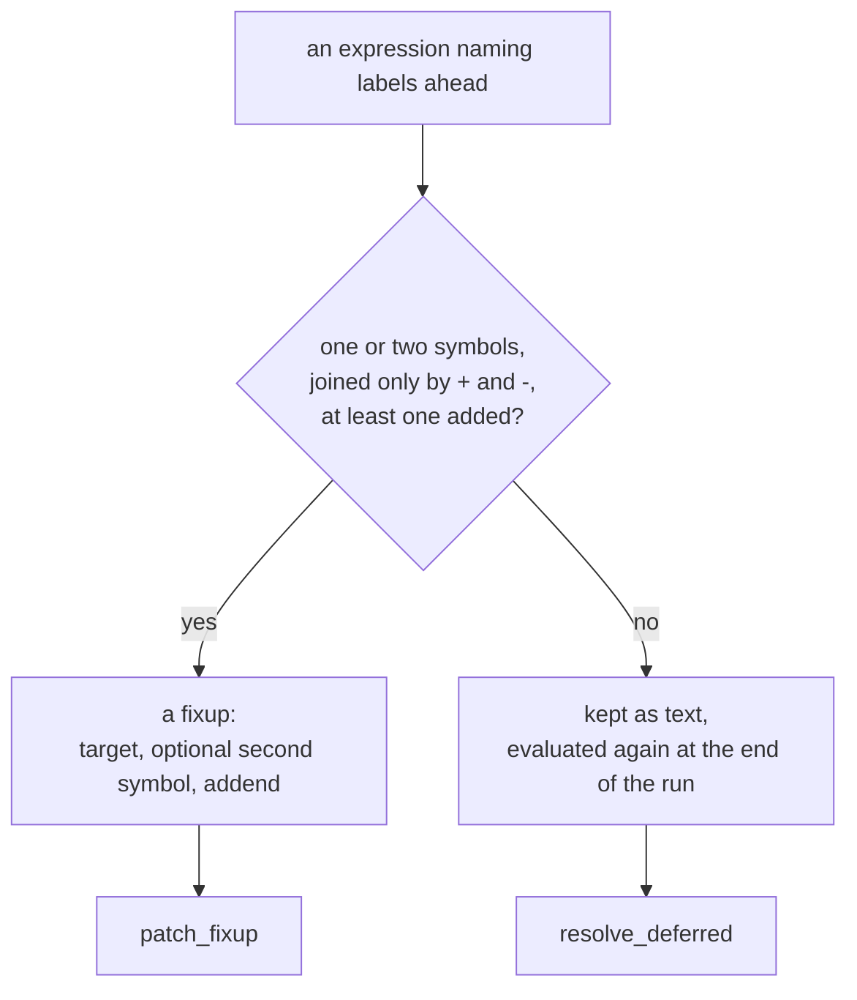
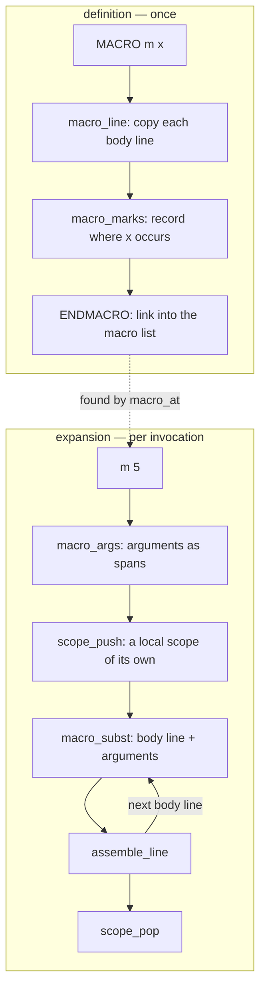

# How zap works

zap assembles eZ80 source in a single pass, on a machine with 512 KB of RAM and
no cache. Most of the design follows from those two facts. This document walks
through the parts and how they fit together.

The assembler is split into seven parts, each with a header for what the
others need from it:

| file | contents | sections |
|---|---|---|
| [`zap.c`](../src/zap.c) | the line loop, listing, error reporting, command line, `main` | 1, 11, 12 |
| [`scan.c`](../src/scan.c) | character classes, tokens, registers | 4 |
| [`insn.c`](../src/insn.c) | mnemonic tables, row selection, emitting | 5, 6 |
| [`symtab.c`](../src/symtab.c) | symbols, local labels, fixups | 7 |
| [`expr.c`](../src/expr.c) | expressions, forward references, `EQU` | 8 |
| [`directive.c`](../src/directive.c) | directives and the output window | 9 |
| [`macro.c`](../src/macro.c) | macro definition and expansion | 10 |
| [`object.c`](../src/object.c) | relocatable objects: segments and the ELF writer | [LIBRARIES.md](LIBRARIES.md) |

[`zap.h`](../src/zap.h) holds what they all share: types, the global state,
size constants, and declarations. The instruction table is generated into
[`src/isa_table.c`](../src/isa_table.c), and the buffered reader, number parser
and character conversions are small units of their own.

The hot path deliberately crosses these boundaries. `assemble_line` has the
operand parser, row matcher and emitter inlined into it, and the compiler can
only inline what it can see, so those twenty or so functions live in
`<part>.h` rather than `<part>.c`. Rule 5 in section 14 explains why.

Code links in this document point at definitions, which for those functions
means the header.

---

## 1. The shape of a run



[`main()`](../src/zap.c#L1776) ·
[`parse_args()`](../src/zap.c#L904) ·
[`run()`](../src/zap.c#L591) ·
[`run_lines()`](../src/zap.c#L449) ·
[`scope_end()`](../src/symtab.c#L843) ·
[`resolve_fixups()`](../src/zap.c#L425) ·
[`out_flush()`](../src/directive.c#L59) ·
[`resolve_late()`](../src/zap.c#L383)

There's no intermediate representation or syntax tree. Each line is read,
turned into bytes and forgotten. The only things that outlive a line are what
later lines might need: the symbols it defined, any fixups it left, and the
bytes.

---

## 2. One pass, and what it costs

A reference to a label further down the file can't be resolved when it's read.
A two-pass assembler reads the source twice; zap reads it once and patches the
output afterwards.



Each fixup also records the line number, so an error found while patching (an
unknown label, a jump out of range, a value that doesn't fit) is reported
against the line that used the label.

The fixup list normally only grows. If it can't grow any more because memory
has run out, [`fix_sweep()`](../src/symtab.c#L1064) settles every entry whose
labels are now known, compacts the list, and carries on. Section 7a covers
what can be settled early.

Originally the whole output had to fit in memory, which limited what zap could
assemble on a 512 KB machine. Now the output buffer is a window (`OUT_WINDOW`
bytes) onto a file that's written as the window fills, so memory use doesn't
depend on output size. Section 2a covers how patches reach bytes that have
already been written out.

The real limits now are the SD card and addressing. Output positions are
`int`, which is three bytes on the eZ80, so past `OUT_TOTAL_MAX` (0x7FFFFF) a
position would silently wrap negative. `out_reserve` and `out_reserve_n` refuse
any write that would cross that line, and `DS`, `BLK`, `ORG` padding and
`INCBIN` check their full size up front, since each can ask for more than a
window at once. Section 13 notes what this refuses that ez80asm would accept.

Three kinds of thing wait for the end of the run:

| | resolved by | holds |
|---|---|---|
| fixup | [`patch_fixup()`](../src/symtab.c#L633) | one or two symbols, an addend, a width, an offset |
| deferred expression | [`resolve_deferred()`](../src/zap.c#L262) | expression text a fixup can't represent |
| deferred fill | [`resolve_fills()`](../src/zap.c#L294) | a `BLK` whose fill value wasn't known yet |

A [`fixup`](../src/zap.h#L687)'s width is usually a byte count (1 to 4) or 0 for
a relative jump. A few special widths cover operands that aren't simply bytes
after the opcode:

- Three "folds", where the value goes into the opcode byte itself: a bit
  number, an interrupt mode, or a restart address. This is how `bit n, a`
  works when `n` is defined later. [`fold_mask()`](../src/symtab.c#L588) turns
  the value into a mask, range-checks it, and it's OR'd into the opcode.
- Two for an index displacement, the signed byte in `(ix+d)`. These need their
  own widths because the byte isn't just the low eight bits of the value: the
  value is taken as a machine word and must fit a signed byte, and a minus
  sign outside the brackets negates the whole expression, not just its first
  term.
- `FIX_DSINIT`, which writes nothing (see section 9).

### 2a. Patching output that's no longer in memory

Fixups are often settled long after their bytes were written, and with a
window only the last 64 KB of output is still in memory.

For a patch whose target is behind the window, zap still computes the bytes in
the usual place, so all the diagnostics stay the same, and records just the
finished bytes in a [`latepatch`](../src/zap.h#L609). It stores bytes rather
than the symbol because a local label's node is reused once its scope ends, so
by the time the patch was applied the symbol could name a different label. The
folds are stored as a checked mask for the same reason.

At the end, [`resolve_late()`](../src/zap.c#L383) makes one ascending pass over
the file in window-sized chunks, applying late patches and deferred fills, and
skipping chunks that need nothing. It's ascending and chunked because of the
filesystem: MOS's FatFS is built with `FF_FS_TINY`, so a file has no sector
buffer of its own and every partial write is a read-modify-write through a
shared buffer, and `FF_USE_FASTSEEK` is off, so seeking walks the cluster
chain. One seek and write per patch would cost two sector transfers and a
chain walk each; this costs two transfers per chunk.

The late-patch list isn't sorted. It's a series of ascending runs, because
patches are recorded at different moments: when a scope ends, when the fixup
list is swept, and at the end of the source (where globals start again from
the top). Each of those walks its fixups in output order, so the list climbs
and then drops back. A [`laterun`](../src/zap.h#L632) marks one of those
climbs and keeps its own cursor, so the final pass looks at each patch once.
[`out_late()`](../src/directive.c#L168) starts a new run whenever a patch is
lower than the previous one. If it didn't, that patch would be skipped
silently and its bytes never written.

Nothing in the test corpus produces enough output to fill a real window, so
this path is tested by forcing a tiny one:

    ZAP_WINDOW=512 test/corpus.sh

Every source must produce the same bytes at any window size. `test/window.sh`
covers the other side: a generated source several windows long, where every
fixup is settled long after its bytes were written.

---

## 3. The state

Everything the assembler knows is in one global object,
[`state`](../src/symtab.c#L230), of type [`zap_state`](../src/zap.h#L1191),
defined in `symtab.c` and declared in `zap.h`.



On the eZ80, a global's field addresses are constants built into each
instruction. Passing the state around by pointer would mean loading that
pointer from the stack frame before every access. The trade-off is that one
process can only assemble one source at a time.

Field order matters. The fields touched on every line (cursor, line number,
error code) come first, and the big, rarely used ones (the 256-byte local
bucket array, the include path) come last, so the hot fields stay within reach
of a short displacement.

---

## 4. Reading the source

[`buf_reader`](../src/buf_reader.h#L42) hands out whole lines. It fills a
buffer, trims it back to the last newline, and carries the partial line at the
end over to the start of the next fill.



The rest of the assembler relies on two things this gives it:

- tokens can point straight into the buffer, because refills only happen
  between lines;
- there's always a newline right after the content (the sentinel), so scans
  can stop on it without checking for the end.

[`include_file()`](../src/directive.c#L860) opens a second reader and runs the
same line loop on it, saving the parent's reader in its own stack frame. MOS
has few file handles, so the parent's file is closed while the include runs
and reopened afterwards at the same position.

---

## 5. Assembling a line

[`assemble_line()`](../src/zap.c#L26) is the hot path, and everything it needs
is inlined into it: label parsing, mnemonic lookup, operand parsing, row
matching and emitting. Each line is examined once, left to right.



[`equ_line()`](../src/expr.c#L608) ·
[`mnemonic_of()`](../src/insn.h#L87) ·
[`parse_operand()`](../src/expr.h#L108) ·
[`match_row()`](../src/insn.h#L150) ·
[`emit_row()`](../src/insn.h#L327) ·
[`directive_line()`](../src/directive.c#L1062) ·
[`suffixed_mnemonic()`](../src/insn.c#L569) ·
[`third_operand()`](../src/insn.c#L660)

- The mnemonic lookup buckets by first letter and length, so it usually
  compares one or two candidates and never has to measure a string.
- Operands are parsed into a fixed 21-byte [`dop`](../src/zap.h#L260): a
  register-set bitmask in three byte-wide planes, a mode (register, indirect,
  immediate, indirect immediate), an immediate value, a displacement, and any
  forward reference.
- Anything that isn't an instruction (directives, macros, suffixed mnemonics)
  is reached by a tail call once the mnemonic lookup fails, so ordinary
  instructions never pay for those checks.

---

## 6. Selecting an instruction

[`src/isa_table.c`](../src/isa_table.c) holds the whole instruction set,
generated from ez80asm's tables by [`tools/gen_isa.py`](../tools/gen_isa.py).
It has three levels:



- An [`isa_row`](../src/isa.h#L112) describes what the two operands must be,
  how each is folded into the opcode, the prefix and opcode bytes, which CPUs
  support it, and which mode suffixes it accepts.
- A mode group collects a mnemonic's rows that expect the same operand shapes,
  so a whole group can be rejected at once. `call`, `jp`, `jr` and `ret` aren't
  grouped, because a condition code can arrive in a shape the group test would
  wrongly reject.
- [`match_row()`](../src/insn.h#L150) checks operand A first and only looks at
  B if A matches. Most rejections are rows of the right shape with the wrong
  registers.

Once a row is chosen, [`emit_row()`](../src/insn.h#L327) writes the bytes in
this order:



The one exception is `bit n, (ix+d)`, where the displacement comes before the
opcode.

`.CPU` selects an instruction set by masking rows. The Z80 set includes the
undocumented instructions, and neither the Z80 nor the Z180 has ADL mode or
mode suffixes.

---

## 7. Symbols

There are three kinds of label, kept in two tables.



Global labels and EQU values ([`sym`](../src/zap.h#L211),
[`sym_intern()`](../src/symtab.c#L460)) are added to the table the first time
they're seen, defined or not, so a forward reference gets an entry for its
fixup to point at. Nodes and names come from blocks that are never moved or
resized. A growing array would need `realloc`, and a `realloc` that moves the
data briefly needs memory for both copies.

Local labels (`@name`, [`loc_intern()`](../src/symtab.c#L906)) belong to the
global label above them. A scope ends at every global label, which happens
thousands of times in a real program, so clearing the table has to be cheap.
Each bucket records which scope it belongs to, so bumping a generation counter
in [`scope_end()`](../src/symtab.c#L843) makes every bucket read as empty
without touching them.

Anonymous labels (`@@`, used as `@f` and `@b`) aren't in a table at all.
[`anon_define()`](../src/symtab.h#L30) keeps the address of the last `@@` for
`@b`, plus one nameless symbol that every `@f` since the last `@@` waits on,
settled when the next `@@` appears.

When a scope ends, its local fixups are patched. A fixup that involves both a
global and a local label gets the local half folded into its addend right
then, because the local's node is about to be reused.

### 7a. The fixup list and when it's swept

Each fixup is 16 bytes, and [`fix_add()`](../src/symtab.c#L1101) grows the list
`FIX_STEP` records at a time. Normally nothing is removed until the end, so the
list holds one record per forward reference. `-x` reports both the total and
the peak, which are equal unless the list was swept.

When memory runs out, [`fix_sweep()`](../src/symtab.c#L1064) settles what it
can instead of giving up. Real programs usually have plenty to settle: at any
point, BBC BASIC for Agon only needs about 490 of its 2,209 fixups, and a CP/M
implementation 950 of 1,859. The rest refer to labels that have already been
defined.

A fixup can be settled early only if ([`fix_ready()`](../src/symtab.c#L1034)):

- its target (and second symbol, if any) is defined. The placeholder symbols
  used for deferred expressions stay undefined until the end, so they're
  skipped automatically;
- it isn't a relative jump inside an open `RELOCATE`, since that depends on
  `state.org`, which `RELOCATE` changes. Outside a relocate, the origin is the
  same as it will be at the end;
- it isn't listed in `subfix`, which holds fixups still waiting for a local
  label's value to be folded in.

`subfix` stores indices into the fixup list, and
[`fold_subs()`](../src/symtab.c#L799) uses them at every scope end, so
compacting the list would break them. Both lists are in ascending order, so the
sweep updates each index as it moves the entry.

A fixup whose bytes have already been written to the card is settled like any
other, with the result recorded as a late patch. That didn't use to be
possible. The late-patch list could only hold two runs, so the sweep had to
skip anything behind the window, and each flush left behind whatever the last
sweep hadn't reached. Those leftovers piled up until nothing could be freed,
which capped a reference-heavy source at about four windows of output no
matter how short its references were. Measured with `test/gen_worst.sh`, 256 KB
of output used to fail even when every reference reached only 200 bytes ahead;
now it assembles. The remaining limit is the one any single-pass assembler has:
the references outstanding at any moment have to fit in memory.

The sweep runs when the list can't grow, not when a label is defined, and
there's a correctness reason for that. `X: EQU v` is briefly defined twice: the
label code first records the current address, and `equ_line` then replaces it
with the real value. A sweep triggered by "a label was defined" would settle
references to every EQU with the wrong value. No fixup is created between
those two steps, because `EQU` doesn't allow forward references, so a sweep in
`fix_add` can never see that state. Sweeping only when memory runs out also
keeps it free in practice: sweeping on every growth cost BBC BASIC 3.1% on the
Agon for no benefit.

Settling early does change when a fixup's diagnostic appears. A `-w` warning
is printed when the list fills up rather than at the end, and an error there
(a jump out of range, say) stops the run immediately, so it's reported instead
of whatever else might have failed later. Either way the message names the line
that used the label: `patch_fixup` sets `state.line` for that, and the sweep
restores the current line afterwards, except when it fails, where the line
`patch_fixup` set is the one the report needs.

---

## 8. Expressions

Most operands never reach the expression evaluator: registers, plain literals
([`lit_value()`](../src/directive.h#L27)) and bare names each have their own
fast reader. What does reach it is a precedence-climbing parser
([`expr_value()`](../src/expr.c#L549), [`expr_atom()`](../src/expr.c#L200))
over `+ - * / << >> & | ^`, unary `-` and `~`, with `[...]` for grouping since
parentheses already mean indirection.

Two things about it are unusual:

- There are two operator-precedence tables. Under `-ez80` every operator has
  the same precedence, and precedence climbing with equal precedences gives
  exactly ez80asm's left-to-right evaluation, so the compatible mode comes for
  free.
- The evaluator is 32 bits wide while the machine word is 24. `DW32` and `BLKL`
  need four bytes, and ez80asm evaluates in 32 bits, so truncation happens only
  when a value is written. The fast readers stay 24-bit and hand anything wider
  to `num_parse`, so the common case doesn't pay for the extra width.

While evaluating, labels that aren't defined yet are tracked along with their
signs, and what happens next depends on the expression's shape:



---

## 9. Directives

Directives are only checked once the mnemonic lookup has failed.
[`directive_of()`](../src/directive.c#L276) identifies them with a switch on
length and characters rather than a table, and
[`directive_line()`](../src/directive.c#L1062) handles them.

| group | directives |
|---|---|
| data | `DB` `DW` `DL` `DW24` `DW32` `ASCIZ` (and the `DEFB`/`BYTE`/`ASCII` spellings) |
| space | `DS` `BLKB` `BLKW` `BLKP` `BLKL` `ALIGN` `FILLBYTE` |
| address | `ORG` `.RELOCATE` `.ENDRELOCATE` `ASSUME ADL=` |
| symbols | `EQU` |
| files | `INCLUDE` `INCBIN` |
| conditional | `IF` `ELSE` `ENDIF` |
| macros | `MACRO` `ENDMACRO` |
| target | `.CPU` |

A few of these behave in ways that are easy to get wrong:

- `DS` reserves ([`fill_take()`](../src/directive.c#L623)) while `BLK` emits
  ([`emit_block()`](../src/directive.c#L670)). A reservation is just a count:
  nothing is written until something comes after it (`out_settle()`, called
  from `out_reserve()`). Reserved space at the very end of a file is never
  written at all, and a `FILLBYTE` while a reservation is pending changes what
  it will be filled with. A block is always written.
- `ORG` padding isn't a reservation. It goes through
  [`fill_put()`](../src/directive.c#L580) and is written immediately, as
  ez80asm does, so it survives at the end of a file where a `DS` wouldn't, and
  a later `FILLBYTE` doesn't change it. `fillbyte 0x11 / org $+4 / fillbyte
  0xAA` gives four `0x11` bytes; the same thing with `DS` gives `0xAA`.
- `FILLBYTE` only affects reservations after it. ez80asm 2.2 filled gaps in its
  second pass with whatever the last `FILLBYTE` was, so earlier reservations
  picked up a later value, and zap used to reproduce that. 2.3 has no second
  pass, and neither does zap.
- The initializer in `ds 4, v` is evaluated and then ignored: it's four fill
  bytes, not four `v`. zap warns when `v` differs from the fill byte, and it's
  an error if `v` names a label that's never defined, because ez80asm handles
  it as a fixup. `FIX_DSINIT` is the fixup width that writes nothing.
- `ORG` is really two directives. The first one in a file sets the origin;
  every later one pads up to its address.

The conditional directives are ordered in the enum so that, inside a skipped
block, one comparison decides whether a line still needs handling: everything
from `IF` up is processed while skipping, and everything below it is ignored.

---

## 10. Macros

A macro definition stores its body as text and records where its parameters
appear, once, when the body is read. Each occurrence is a
[`macmark`](../src/zap.h#L344): an offset into the body, a parameter number and
a length.



[`macro_expand()`](../src/macro.c#L507) ·
[`macro_args()`](../src/macro.c#L358) ·
[`macro_subst()`](../src/macro.c#L421) ·
[`scope_push()`](../src/expr.c#L715)

Expanding a macro doesn't need a reader or a nested line loop, because the body
is already a sequence of lines. Substitution is plain text with no parentheses
added, as in ez80asm: with `x` bound to `1+1`, `db 10-x` is 10, not 8. zap
only substitutes whole identifiers, though, which is one of the deliberate
differences in section 13.

Macros nest up to eight levels, the same limit as `INCLUDE`. Each level has its
own substitution buffer, which is kept and grown between uses rather than
allocated per expansion.

---

## 11. Diagnostics

Errors are codes rather than strings: `state.err` is a
[`zap_err`](../src/zap.h#L497), and the messages live in
[one table](../src/symtab.c#L24) next to the enum. Code other than `main` can
check the code directly, which makes the assembler usable as a library.

Everything a report needs is captured at the point of failure, never tracked
in advance, so a clean run pays nothing for it:


[`err_line()`](../src/symtab.c#L250) ·
[`err_tok()`](../src/symtab.h#L52) ·
[`report()`](../src/zap.c#L1719)

```
Macro [mos_call] in "kernel.s" line 12 - unknown label 'MOS_SYSVARS'
  ld a, MOS_SYSVARS
Invoked from "main.s" line 84 as
  mos_call MOS_SYSVARS
```

The truncation warning, [`warn_trunc()`](../src/zap.c#L1643), is different
from other diagnostics: it has to check every value in every source, rather
than doing work only after something has gone wrong. That's why it's behind
`-w`.

---

## 12. Listings and other output files

`-l` and `-d` write a listing in ez80asm's format (address, up to four bytes
per row, line number, then the source line as written) through
[`list_line()`](../src/zap.c#L1185) and [`list_out()`](../src/zap.c#L1163). A
macro expansion is listed the way ez80asm lists it: the invocation with no
bytes, the arguments, then one row per body line tagged with its depth.

A line containing a forward reference is listed before the reference is
patched. [`lstfix_add()`](../src/zap.c#L1291) remembers those lines, and
[`lstfix_apply()`](../src/zap.c#L1324) rewrites their byte columns from the
finished output before the file is closed. The console listing (`-d`) can't be
rewritten, so it shows the bytes as first emitted.

After the line number comes a fixed ten-character depth column: a `*` for each
level of `INCLUDE`, then `M<n> ` for a macro body or three spaces otherwise,
then padding. Because the width is fixed, a single pass can write it. ez80asm
2.2 only widened this column when the file contained a macro expansion, which
it decided before writing line 1, so zap couldn't match it until 2.3 made the
width constant.

Two differences remain, and the sources in `test/regress/listing` avoid both:

- A macro body loses its indentation, because zap stores the body starting at
  its first token.
- ez80asm lists a reservation's fill bytes on an extra row under the directive.
  zap leaves the first row empty the same way but doesn't write the extra row.
  `ORG` padding is listed inline by both.

[`write_symbols()`](../src/zap.c#L1503) writes the sorted global symbols in
ez80asm's format, and [`write_stats()`](../src/zap.c#L1569) prints resource
usage. None of these can fail an assembly, since the output file is already
written by the time they run.

---

## 13. Compatibility

Matching ez80asm byte for byte is the point of the project, so where ez80asm
does something surprising, `-ez80` reproduces it: no operator precedence,
`IF a == b` ignoring the comparison, and `0bh` read as hex.

There are three intentional differences:

- A negative `DS` is an error. ez80asm treats the count as unsigned and writes
  about 4 GB; reproducing that would just fill the SD card.
- Output past the 24-bit address range is an error. ez80asm on a desktop will
  happily write an 8 MB file, but on the Agon there's nowhere to put it, and
  zap's positions are 24-bit `int`s that would silently wrap. The last 13
  bytes below the limit are refused too, because each instruction reserves
  room for the longest possible one. The host build uses the same limit, so
  the tests can check the refusal.
- Macro parameters are only substituted as whole identifiers. ez80asm
  substitutes any occurrence at the end of an identifier, so with a parameter
  `x`, `db max` becomes `db ma1`. Copying that would make a macro's meaning
  depend on whether its parameter names happen to end other names.

All three still hold against ez80asm 2.3. Tests for them would fail by design,
so none are in `test/regress`.

`@local - global` with both labels defined later used to be on this list, but
zap now handles it: the local half is folded in when the scope ends, and the
rest is settled with the globals. `test/regress/scopes` checks the three
variants.

`-w` is zap's own flag, and its warning being off by default is the only case
where the same command line behaves differently in the two assemblers.

---

## 14. What the target imposes

The eZ80 shapes this code more than anything else. Five rules come up
throughout:

1. Ordinary C turns into library calls. A 24-bit AND, a multiply, a variable
   shift, a signed comparison: each is a function call rather than an
   instruction. Byte-sized values, powers of two and unsigned comparisons avoid
   most of them.
2. Stack frames must stay under 128 bytes. Frame offsets are a signed byte, and
   past that every access needs a computed address. Adding three bytes to
   `assemble_line`'s frame shows up in the whole program's timing. (Section 0
   of the [optimization guide](../ez80_advanced_optimization_guide.md) defines
   frames, spills and the rest.)
3. `static inline` is only a hint, and a single cold call site can stop a
   function being inlined everywhere. The hot-path helpers use
   `always_inline`.
4. Every character scan checks its bound. Without it the compiler may rotate
   the loop so the first character is never examined, which works on the host
   and fails on the target. [`test/run.sh`](../test/run.sh) checks the source
   for this.
5. A function inlined across files needs its body in a header. There's no
   link-time optimization, so a compiler that only sees a declaration emits a
   call. The functions inlined into `assemble_line` are defined in
   `<part>.h`; leaving them in `<part>.c` cost 3% on bbcbasic.

The [optimization guide](../ez80_advanced_optimization_guide.md) has the
details and measurements behind each rule.

---

## 15. How it's tested

| | |
|---|---|
| [`test/run.sh`](../test/run.sh) | unit and CLI tests, plus every source in `test/cases` assembled by zap and the vendored ez80asm and compared byte for byte |
| [`test/corpus.sh`](../test/corpus.sh) | ez80asm's 507-source test suite plus zap's regression sources, compared the same way |
| `ZAP_WINDOW=512 test/corpus.sh` | the same with a tiny output window, so every source goes through the streaming path |
| `FIX_CAP=1024 test/corpus.sh` | the same with a capped fixup list, so the sweep in section 7a runs everywhere |
| [`test/window.sh`](../test/window.sh) | a generated source several windows long, with every fixup width settled long after its bytes were written |
| [`test/bench/bench.sh`](../test/bench/bench.sh) | timings against ez80asm on the emulator |
| [`test/bench/corpus-target.sh`](../test/bench/corpus-target.sh) | per-source speedups across the whole test suite on the emulated Agon |
| [`test/hwkit.sh`](../test/hwkit.sh) | builds an SD card image with binaries, sources and an Obey script to measure the output window on real hardware, since the emulator doesn't model SD write speed |

The ground rule is that ez80asm is the reference. When there's a question about
what zap should do, the answer comes from assembling the case with ez80asm and
looking at the bytes, not from reasoning about what an assembler ought to do.

---

## 16. Adding something

- An instruction form goes in the generator,
  [`tools/gen_isa.py`](../tools/gen_isa.py), not the generated table.
- A directive needs a `DIR_` constant, a spelling in
  [`directive_of()`](../src/directive.c#L276), a case in
  [`directive_line()`](../src/directive.c#L1062), a test file under
  `test/cases` compared against ez80asm, and a row in the README's directive
  table.
- A diagnostic needs a [`zap_err`](../src/zap.h#L497) code and one line in the
  message table. A static assert on the table size catches a code with no
  message.
- Measure anything on the hot path on the Agon before and after. The host
  doesn't predict the target: the same change measured 0.71x on a desktop and
  0.98x on the Agon.
