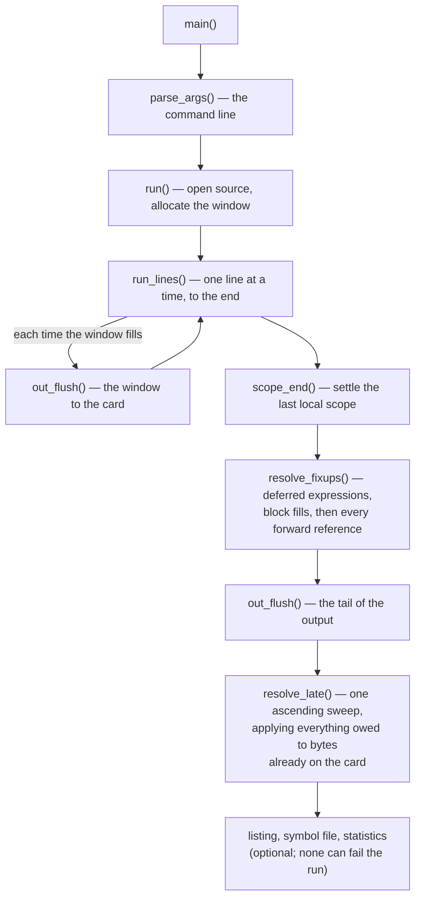
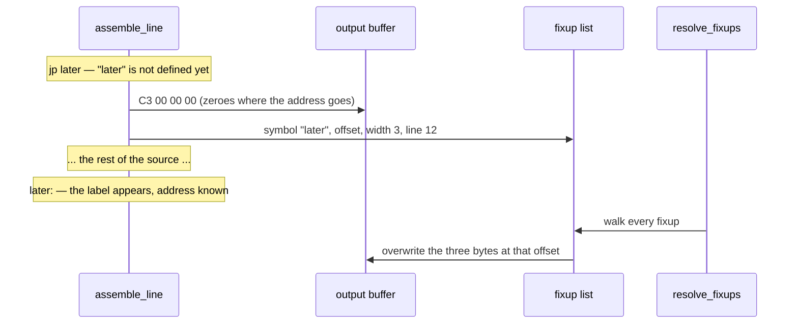
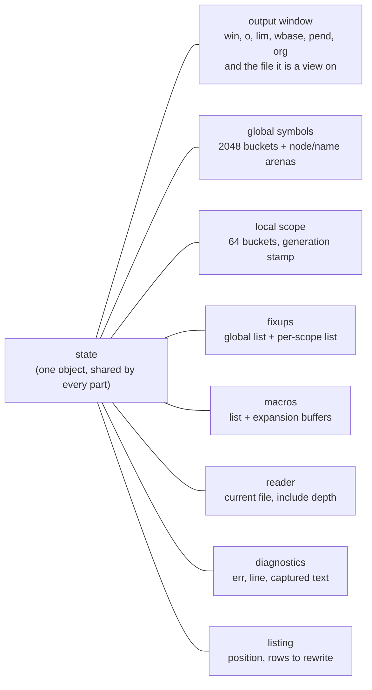
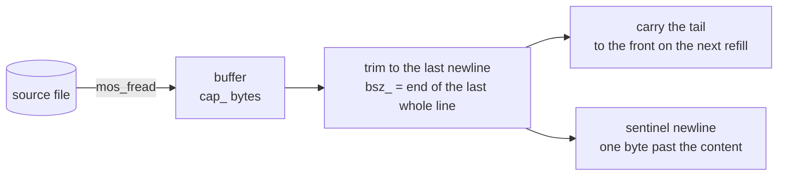
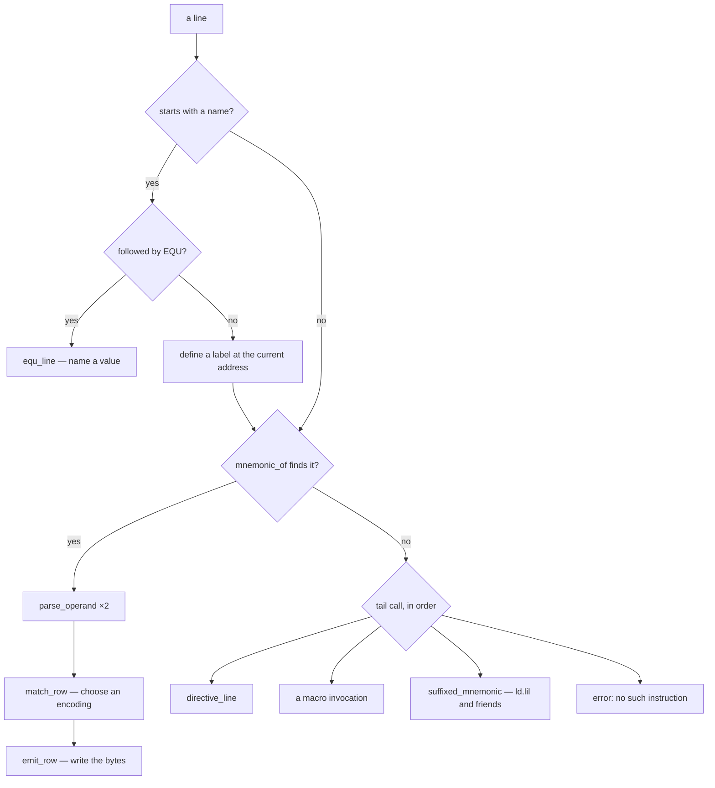
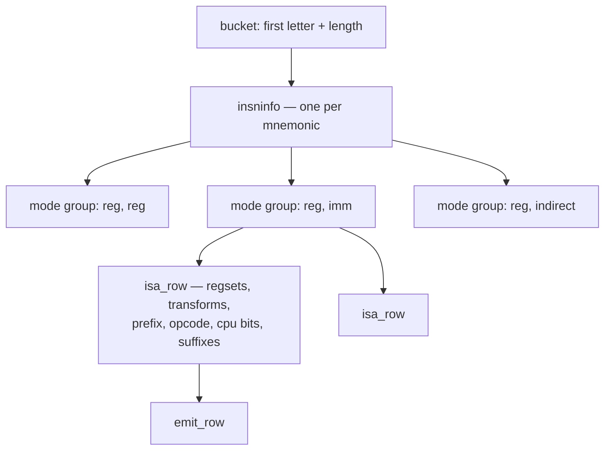
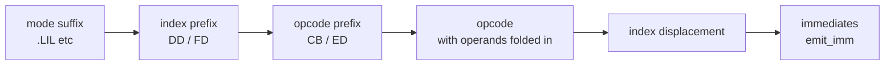
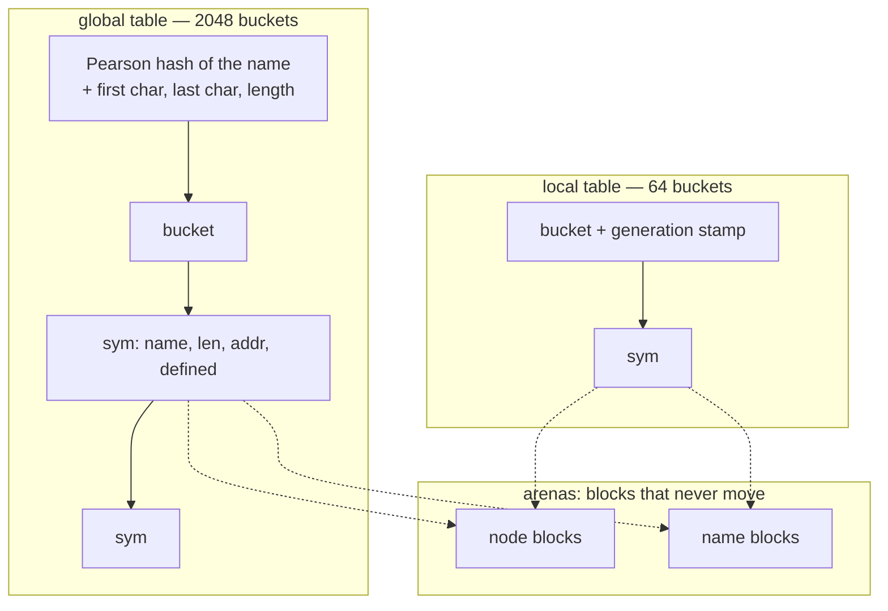
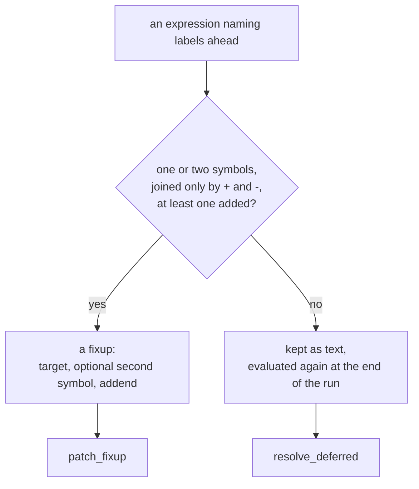
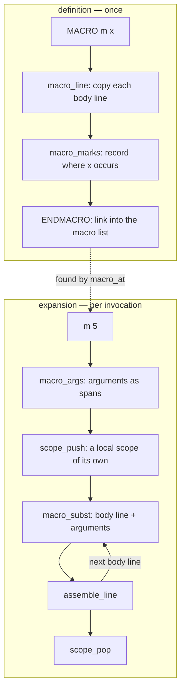

# How zap works

zap assembles eZ80 source into a binary in **one pass**, on a machine with
**512 KB of RAM and no cache**. Those two facts explain most of the design;
this document describes the parts and how they fit together.

The assembler is seven files. Each has a header holding what the other parts
need from it, and the sections below follow them:

| file | what is in it | sections |
|---|---|---|
| [`zap.c`](../src/zap.c) | the line loop, listing, reporting, the command line, `main` | 1, 11, 12 |
| [`scan.c`](../src/scan.c) | character classes, tokens, registers | 4 |
| [`insn.c`](../src/insn.c) | mnemonic tables, row selection, emitting | 5, 6 |
| [`symtab.c`](../src/symtab.c) | symbols, interning, local labels, fixups | 7 |
| [`expr.c`](../src/expr.c) | expressions, forward references, `EQU` | 8 |
| [`directive.c`](../src/directive.c) | directives, and the output window | 9 |
| [`macro.c`](../src/macro.c) | definition and expansion | 10 |

[`zap.h`](../src/zap.h) holds what all of them share: the types, the state, the
constants that size it, and one declaration per symbol a part offers the
others. The instruction table is generated into
[`src/isa_table.c`](../src/isa_table.c); the buffered reader, the number parser
and the character conversions are small units of their own.

The hot path crosses those boundaries on purpose. `assemble_line` has the
operand parser, the row match and the emitter inlined into it, and a compiler
inlines only what it can see — so the twenty functions in that position have
their bodies in `<part>.h` rather than `<part>.c`. Nothing else does; rule 5 in
section 14 is the long version.

Links in this document point at the definition of the thing being described,
which for those twenty is the header.

---

## 1. The shape of a run



[`main()`](../src/zap.c#L1704) ·
[`parse_args()`](../src/zap.c#L882) ·
[`run()`](../src/zap.c#L587) ·
[`run_lines()`](../src/zap.c#L445) ·
[`scope_end()`](../src/symtab.c#L805) ·
[`resolve_fixups()`](../src/zap.c#L421) ·
[`out_flush()`](../src/directive.c#L61) ·
[`resolve_late()`](../src/zap.c#L379)

There is no intermediate representation and no syntax tree. A line is read,
turned into bytes, and forgotten. What survives a line is only what a later
line might need: the symbols it defined, the fixups it left behind, and the
bytes themselves.

---

## 2. One pass, and what it costs

A reference to a label further down the file cannot be resolved where it is
read. A two-pass assembler reads the source twice; zap reads it once and
**patches the output afterwards**.



Nothing leaves the fixup list on its own, so on a long source it only grows.
When it will not grow any further — the allocation refused, on a machine with
no more to give — [`fix_sweep()`](../src/symtab.c#L1024) settles everything in
it whose labels have since been read and closes the gaps, and the assembly
carries on with what is left. §7 is what may be settled there and what may not.

The fixup carries the line number as well as the offset, so a failure found at
patch time — an unknown label, a jump out of range, a value that does not fit —
is reported against the line that *used* the label rather than wherever the
patching happened to be.

The price used to be that the whole output had to be in memory at once, which
on a 512 KB machine bounded what could be assembled. It does not any more: the
buffer is a **window** onto a file written as it fills, `OUT_WINDOW` wide, and
what an assembly costs in memory no longer depends on how much it emits. §2a
is how a patch reaches output the window has already passed.

What bounds the output now is the card, and the addressing: every position in
it is an `int`, and `int` is three bytes on the eZ80, so past `OUT_TOTAL_MAX`
— 0x7FFFFF — the position would wrap negative and the file would corrupt in
silence. Every writer asks `out_reserve` or `out_reserve_n` first, and those
refuse the byte that would cross the ceiling; `DS`, `BLK`, `ORG` padding and
`INCBIN` check their whole amount up front, since each can ask for more than a
window at once. §13 has what this refuses that the reference would assemble.

Four kinds of thing wait for the end of the run:

| | resolved by | holds |
|---|---|---|
| fixup | [`patch_fixup()`](../src/symtab.c#L622) | one or two symbols, an addend, a width, an offset |
| deferred expression | [`resolve_deferred()`](../src/zap.c#L262) | expression text a fixup cannot represent |
| deferred fill | [`resolve_fills()`](../src/zap.c#L290) | a `BLK` whose fill value was not known yet |

A [`fixup`](../src/zap.h#L690)'s width is normally a byte count, 1 to 4, or 0
for a relative displacement. Five values above those are operands that are not
whole fields after the opcode:

* three **folds**, where the operand belongs in the **opcode byte itself** — a
  bit number, an interrupt mode, a restart address — so `bit n, a` with `n`
  defined later still assembles correctly. The value is turned into a mask by
  [`fold_mask()`](../src/symtab.c#L577), checked there, and OR'd in;
* two for an **index displacement**, the signed byte of `(ix+d)`. It has widths
  of its own rather than being a one-byte fixup because what goes in that byte
  is not the low eight bits of the value: the reference truncates to sixteen
  and then refuses anything outside a signed byte, and a sign written outside
  the brackets negates the whole expression rather than its first term, which
  is what the second of the two records.

### 2a. Patching output that is no longer in memory

A fixup is settled long after its site was written, and with a window only the
last 64 KB of the output is still there. The rest is on the card.

So a patch whose site is behind the window is *worked out* where it always was
— which keeps every diagnostic where it was, reported against the line that
used the label — and only the finished bytes are recorded, in a
[`latepatch`](../src/zap.h#L592). Only the bytes: a local symbol's node is
handed back when its scope ends, so a record that kept the symbol would name a
different label by the time it was applied. The three folds become a checked
mask for the same reason, checked here and OR'd into the opcode byte later.

[`resolve_late()`](../src/zap.c#L379) then sweeps the file once, ascending, in
window-sized chunks, applying the late patches and the deferred fills
together, and skipping chunks none of them touch. Ascending and
chunked because of the filesystem: `FF_FS_TINY` means a `FIL` has no sector
buffer of its own and every partial write is a read-modify-write through the
one the FAT is also using, and `FF_USE_FASTSEEK` is off, so a seek walks the
cluster chain. A seek and a write per patch would be two sector transfers and a
chain walk each; this is two transfers per chunk.

The list is **a sequence of ascending runs** rather than one sorted list, and
that is not an accident of ordering. Patches are recorded when their fixups are
settled, and settling happens at three sorts of moment: a scope ending, a sweep
of the fixup list, and the end of the source, where the globals start again
from the top of the file. Each walks its own records in output order, so the
list climbs and then steps back. A [`laterun`](../src/zap.h#L615) is one of
those stretches, opened where a record is appended below the one before it, and
it carries its own cursor so that the sweep looks at each patch once rather
than once per chunk. A step backwards with no run opened for it is walked past
in silence -- the bytes are simply never written -- which is why the run is
opened in [`out_late()`](../src/directive.c#L166) itself rather than by
whoever happens to be settling.

Nothing in the corpus emits enough to fill a real window, so the flush, the
recording and the sweep are tested by forcing a small one:

    ZAP_WINDOW=512 test/corpus.sh

Every source must produce the same bytes at any window size. `test/window.sh`
is the other half — a generated source whose output is several windows wide and
whose every fixup is settled long after its site was written.

---

## 3. The state

Everything the assembler knows lives in one object,
[`state`](../src/symtab.c#L231), of type
[`zap_state`](../src/zap.h#L1187). It is defined in `symtab.c` and declared in
`zap.h`, so every part reaches the same one.



A file-scope object is addressed absolutely on the eZ80: the address of a field
is a constant written into the instruction. Reached through a pointer parameter
instead, every access would first load that pointer out of the frame.

The consequence is that **one process assembles one source**. A library API
able to assemble two would have to pass this around again.

Field order inside the struct is deliberate. The fields a line touches — the
cursor, the line number, the error code — are near the front, and the bulky,
rarely-read ones (the 256-byte local bucket array, the include path) are at the
end, so that a displacement from a base register reaches the hot ones.

---

## 4. Reading the source

[`buf_reader`](../src/buf_reader.h#L42) hands out **whole lines**. It reads a
buffer, trims the read back to the last newline in it, and carries the partial
line at the end forward to the front of the next buffer.



Two consequences the rest of the assembler relies on:

* a token can point straight into the buffer, because a refill only ever
  happens at a line boundary;
* there is always a newline one byte past the content — the **sentinel** — so
  every scan terminates on it without testing the end.

[`include_file()`](../src/directive.c#L858) opens a second reader and re-enters the same
line loop; the parent's reader is saved in the include's own stack frame. The
parent's file handle is closed while the child runs and reopened afterwards,
seeking back to where the parent had reached, because MOS has few handles.

---

## 5. Assembling a line

[`assemble_line()`](../src/zap.c#L26) is the hot path, and everything it
needs is inlined into it: the label parser, the mnemonic lookup, the operand
parser, the row matcher and the emitter. A line is examined once, left to
right.



[`equ_line()`](../src/expr.c#L592) ·
[`mnemonic_of()`](../src/insn.h#L87) ·
[`parse_operand()`](../src/expr.h#L94) ·
[`match_row()`](../src/insn.h#L150) ·
[`emit_row()`](../src/insn.h#L327) ·
[`directive_line()`](../src/directive.c#L1060) ·
[`suffixed_mnemonic()`](../src/insn.c#L569) ·
[`third_operand()`](../src/insn.c#L660)

* **The mnemonic lookup** buckets by first letter *and* length, so it compares
  one or two candidates rather than five, and never measures a length at run
  time.
* **Operands** are parsed into a fixed 21-byte [`dop`](../src/zap.h#L260): a
  register-set bitmask in three byte-wide planes, a mode (register, indirect,
  immediate, indirect-immediate), an immediate, a displacement, and any forward
  reference the operand is carrying.
* Everything that is not an instruction is reached by a **tail call** from the
  point where the mnemonic lookup failed, so an ordinary instruction never
  tests for any of it.

---

## 6. Selecting an instruction

[`src/isa_table.c`](../src/isa_table.c) holds the whole instruction set,
transcribed mechanically from the reference assembler by
[`tools/gen_isa.py`](../tools/gen_isa.py). It is arranged in three levels.



* An [`isa_row`](../src/isa.h#L112) says what the two operands must be, how each
  folds into the opcode, the prefix and opcode bytes, which CPUs have it, and
  which mode suffixes it accepts.
* A **mode group** collects the rows of one mnemonic that expect the same
  operand shapes, so a group whose shape does not match is rejected once rather
  than row by row. The four mnemonics that take condition codes — `call`,
  `jp`, `jr`, `ret` — are left ungrouped, because a condition code can arrive
  in a shape the group test would reject.
* [`match_row()`](../src/insn.h#L150) tests operand A first and reaches B only
  if A survives. Most rejections are rows of the right shape with the wrong
  registers.

Once a row is chosen, [`emit_row()`](../src/insn.h#L327) writes the bytes in
this order:



`bit n, (ix+d)` is the one shape where the displacement comes *before* the
opcode.

**`.CPU`** selects an instruction set by masking rows: the Z80 set includes the
undocumented instructions, and neither the Z80 nor the Z180 has ADL or mode
suffixes.

---

## 7. Symbols

Three kinds, in two tables.



**Global labels and EQU values** ([`sym`](../src/zap.h#L211),
[`sym_intern()`](../src/symtab.c#L451)) are **interned on first sight**, defined
or not, so a reference to a label that has not appeared yet gets an entry and a
fixup points at it. Nodes and names come from arenas of blocks that never move:
a growing array would have to be reallocated, and a realloc that moves holds
both copies at once.

**Local labels** (`@name`, [`loc_intern()`](../src/symtab.c#L868)) belong to the
global label above them. A scope ends at the next global label — thousands of
times in a real source — so it must empty in constant time. Each slot carries
the generation it belongs to: advancing the counter in
[`scope_end()`](../src/symtab.c#L805) makes every bucket read as empty, whatever
chain it still holds.

**Anonymous labels** (`@@`, referred to as `@f` and `@b`) are not table entries
at all. [`anon_define()`](../src/symtab.h#L30) keeps the address of the last
`@@` for `@b`, and one nameless symbol that every `@f` since the last `@@`
waits on, settled the moment the next `@@` appears.

When a scope ends, its local fixups are patched, and any fixup naming a global
*and* a local has the local half folded into its addend there and then — the
local's node is about to be recycled.

### 7a. The fixup list, and when it is swept

Sixteen bytes a record, grown `FIX_STEP` at a time by
[`fix_add()`](../src/symtab.c#L1061), and nothing ever leaves it during an
ordinary assembly: what a source costs here is one record per forward
reference, however early the label it names turns up. `-x` prints both the
total and the high-water mark, which are the same number for a file that never
filled the list.

They stop being the same number when the allocation is refused. Rather than
give up, [`fix_sweep()`](../src/symtab.c#L1024) settles what it can and closes
the gaps. Real programs have much to settle: measured by span, BBC BASIC for
Agon would hold 490 of its 2,209 records at once and a CP/M implementation 950
of 1,859, the rest being references whose labels had long since been read.

Four things must be true of a record before it may be settled early, and each
is a correctness requirement rather than a refinement
([`fix_ready()`](../src/symtab.c#L994)):

* its target — and its second symbol, if it has one — is **defined**. The
  nameless stand-ins `resolve_deferred()` fills in stay undefined until the end
  of the run, so they are excluded without a special case;
* it is **not a relative displacement while a `RELOCATE` is open**, because
  that width is measured from `state.org`, which `RELOCATE` moves. Outside a
  relocate the origin is the file's own and is what it will still be at the
  end, so `!state.reloc` is the whole test;
* it is **not named by `subfix`**, whose entries are waiting for a local that
  the scope has not folded yet.

`subfix` holds *indices* into the list, and [`fold_subs()`](../src/symtab.c#L771)
walks them at every scope end, so compacting under it would corrupt them
silently. Both lists ascend, so one pass rewrites each index as its entry moves.

A site the window has already written out is settled here like any other: the
bytes are worked out and recorded as a late patch, exactly as they are at the
end of the run. There used to be a fourth condition refusing that, because the
late list was two runs and could not take a third, and it was what decided how
much the assembler could assemble -- every flush stranded whatever the last
sweep had not reached, the strandings accumulated, and a reference-dense source
was refused at about four windows' worth of output however short its references
reached. Measured with `test/gen_worst.sh`'s span argument: 256 KB of output
was refused at a reach of 200 bytes, and is not now. What is left is the bound
that belongs to a one-pass assembler -- the references outstanding at one
moment have to fit in memory -- and the file's size is no longer part of it.

**The trigger is growth and not a label being defined**, and that is not a
performance choice. `X: EQU v` is defined twice — the label path stores the
line's program counter and `equ_line` overwrites it with the real value a
moment later — so a sweep hung off "a label became defined" would settle every
reference to every EQU against a program counter. Nothing creates a fixup
between those two points, because `EQU` refuses a forward reference outright,
so a sweep in `fix_add` cannot see that window. Sweeping only on refusal is
also what makes it free: on the Agon, sweeping at every growth costs BBC BASIC
3.1% and saves it 161 records it did not need saving.

Settling early moves when a fixup's diagnostic happens. A `-w` truncation
warning is printed where the list filled rather than after the last line of the
source, and a failure there — a jump out of range, a value that does not fit —
ends the run at that point, so it is reported in place of whatever the rest of
the file would have been refused for. Both still name the line that *used* the
label: `patch_fixup` sets `state.line` for exactly that, and the sweep puts the
assembler's own line number back on the way out — except on the failing path,
where the number `patch_fixup` set is the one the report needs.

---

## 8. Expressions

Most operands never reach the evaluator: a register, a plain literal
([`lit_value()`](../src/directive.h#L27)) and a bare name each have a reader of
their own. What does reach it is a precedence climb
([`expr_value()`](../src/expr.c#L533),
[`expr_atom()`](../src/expr.c#L190)) over `+ - * / << >> & | ^` with unary `-`
and `~`, grouped with `[...]` because parentheses already mean indirection.

Two things make it unusual:

* **Two binding-power tables.** Under `-ez80` every operator binds equally, and
  a precedence climb in which everything binds equally is exactly the
  left-to-right fold the reference performs. The compatible behaviour falls out
  of the same code.
* **The evaluator is 32 bits wide** where the machine's word is 24. `DW32` and
  `BLKL` are four bytes, and the reference evaluates in 32 bits; truncation
  happens at the emitter, on the width the directive asked for. The fast
  readers stay in the machine's word and hand anything wider to `num_parse`, so
  the extra width is not paid on the common path.

While an expression is evaluated, the labels it names that are still undefined
are tracked with their signs, and what happens next depends on the shape:



---

## 9. Directives

Reached only after the mnemonic lookup has failed, and dispatched by
[`directive_of()`](../src/directive.c#L274) — a switch on the token's length and
characters rather than a table — then handled in
[`directive_line()`](../src/directive.c#L1060).

| group | directives |
|---|---|
| data | `DB` `DW` `DL` `DW24` `DW32` `ASCIZ` (and the `DEFB`/`BYTE`/`ASCII` spellings) |
| space | `DS` `BLKB` `BLKW` `BLKP` `BLKL` `ALIGN` `FILLBYTE` |
| address | `ORG` `.RELOCATE` `.ENDRELOCATE` `ASSUME ADL=` |
| symbols | `EQU` |
| files | `INCLUDE` `INCBIN` |
| conditional | `IF` `ELSE` `ENDIF` |
| macros | `MACRO` `ENDMACRO` |
| target | `.CPU` |

Two distinctions in this group are easy to get wrong and worth stating:

* **`DS` reserves ([`fill_take()`](../src/directive.c#L621)), `BLK` emits
  ([`emit_block()`](../src/directive.c#L668)).** A reservation is a count, not
  bytes: nothing is written until something is written *after* it, which is
  what `out_settle()` does from `out_reserve()`. So space that reaches the end
  of the file with nothing after it is never written at all, and a `FILLBYTE`
  while a run is still pending simply changes what it will be written with.
  A block always is written.
* **`ORG` padding is not a reservation.** It goes through
  [`fill_put()`](../src/directive.c#L578) and is written where it stands, as
  the reference writes it: it survives at the end of a file where a `DS` is
  dropped, and a later `FILLBYTE` does not reach back to it. `fillbyte 0x11 /
  org $+4 / fillbyte 0xAA` is four `0x11`; the same shape with `DS` is `0xAA`.
* **A `FILLBYTE` decides the reservations below it and none above.** A run
  already written keeps the byte it was written with, so `fillbyte` never
  reaches backwards. 2.2 did reach backwards -- it filled the gaps in its
  second pass, with a `fillbyte` that survived the pass boundary, so a run
  above the file's first one took the file's *last* value -- and zap kept a
  list of those runs to reproduce it. There is no second pass in 2.3 and the
  list is gone.
* **The initializer after the count is evaluated and then dropped.** `ds 4, v`
  is four fill bytes, not four `v`. It is said when `v` differs from the fill
  byte and it is an *error* when `v` names a label the file never defines,
  because the reference does both from a fixup -- `FIX_DSINIT` is the one that
  writes nothing.
* **`ORG` is two directives sharing a name.** The first in a file moves the
  origin; every later one pads out to its address.

The conditional directives are ordered in the enum so that a line inside a
switched-off branch can decide what to do with a single comparison: everything
at or above `IF` is still handled while skipping, everything below it is
skipped.

---

## 10. Macros

A definition captures the body **as text** and finds the places its parameters
occur *once*, when the body is read. Each occurrence is a
[`macmark`](../src/zap.h#L344): an offset into the body, a parameter number and
a length.



[`macro_expand()`](../src/macro.c#L507) ·
[`macro_args()`](../src/macro.c#L358) ·
[`macro_subst()`](../src/macro.c#L421) ·
[`scope_push()`](../src/expr.c#L698)

There is no reader and no nested line loop for an expansion: the body is
already a run of lines. Substitution is textual and by whole identifier, which
is what the reference does — with `x` bound to `1+1`, `db 10-x` is ten there,
not eight.

Nesting is bounded at eight levels — the same bound as `INCLUDE` — and each
level has its own substitution buffer, kept and grown between invocations
rather than allocated per expansion.

---

## 11. Diagnostics

Errors are **codes**, not strings: `state.err` is a
[`zap_err`](../src/zap.h#L488), and the message text lives in
[one table](../src/symtab.c#L24) beside the enum. A caller other than `main` can
branch on the code, which is what makes the assembler usable as a library.

Everything a report needs is **captured at the moment of failure and never
maintained in advance**, so a source that assembles cleanly pays nothing:


[`err_line()`](../src/symtab.c#L241) ·
[`err_tok()`](../src/symtab.h#L47) ·
[`report()`](../src/zap.c#L1647)

```
Macro [mos_call] in "kernel.s" line 12 - unknown label 'MOS_SYSVARS'
  ld a, MOS_SYSVARS
Invoked from "main.s" line 84 as
  mos_call MOS_SYSVARS
```

There is one warning, [`warn_trunc()`](../src/zap.c#L1571), for a value too
large for the space it is written into. It is the only diagnostic that asks a
question of every value in every source rather than doing work after something
has gone wrong, so it is behind `-w`.

---

## 12. Listing and sidecars

`-l` and `-d` write a listing in the reference's columns — address, up to four
bytes per row, line number, and the source line as written — through
[`list_line()`](../src/zap.c#L1113) and [`list_out()`](../src/zap.c#L1091). A
macro expansion is listed as the reference lists it: the invocation with no
bytes, the arguments, then a row per body line tagged with its depth.

A line holding a forward reference is listed before that reference is patched,
so those lines are remembered by [`lstfix_add()`](../src/zap.c#L1219) and their
byte columns written again from the finished output by
[`lstfix_apply()`](../src/zap.c#L1252) before the file is closed. The console
listing cannot be given that treatment and shows the bytes as they were
emitted.

After the line number comes a **depth column of a fixed ten characters**: one
`*` per level of `INCLUDE` below the top, then `M<n> ` for a macro body or
three spaces for anything else, then padding. Fixed width is what lets a
single pass write it. 2.2 widened that column for the whole file when the file
listed an expansion — a decision taken before line 1, with the whole source
already read, and one of the things this could not do.

Two differences are left, and `test/regress/listing` holds only sources that
avoid both:

* **a macro body's indentation.** The body is stored from its first token, so
  the spaces it was written with are not there to list;
* **a reservation's fill.** The reference lists it on a continuation row with
  the first row left empty. zap leaves the first row empty as the reference
  does and writes no continuation row. An `ORG`'s padding is written where it
  stands and is listed inline by both.

Two others used to belong on that list. A line holding a forward reference
showed the bytes as they were emitted rather than as they were patched, which
is what `lstfix_add` and `lstfix_apply` above are for; and the column width
above, which 2.3 made a constant.

[`write_symbols()`](../src/zap.c#L1431) writes the global symbols sorted, in
the reference's format. [`write_stats()`](../src/zap.c#L1497) prints what the
run used. None of the three can fail an assembly: the output file is already
written when they run.

---

## 13. Compatibility

Byte-for-byte agreement with `ez80asm` is the point of the project, so where
the reference does something surprising, `-ez80` reproduces it rather than
being right and incompatible: no operator precedence, `IF a == b` discarding
the comparison, `0bh` read as hex.

Two differences are deliberate and permanent:

* **A negative reservation is refused.** `DS -1` is a count the reference
  treats as unsigned, so it writes about four gigabytes; zap says so and stops.
  This is the one place zap refuses something the reference accepts, and it is
  refused rather than reproduced because reproducing it means filling the card.
* **An output past the 24-bit range is refused.** On a desktop the reference
  assembles an eight-megabyte file happily; on the Agon it has nowhere to put
  it, and zap's positions are `int`, which is three bytes there — past
  0x7FFFFF the arithmetic wraps and the file corrupts rather than failing. So
  the ceiling is checked, and the byte that would cross it is refused. The
  last thirteen bytes under the ceiling go with it, because an instruction is
  granted room for the largest one there is — the same headroom the window's
  own limit carries. On the host the check reads the same constant, which is
  what lets the tests write past the ceiling and watch the refusal.
* **A macro parameter is substituted as a whole identifier.** The reference
  substitutes any occurrence that *ends* an identifier, so with a parameter `x`
  bound to `1`, a body line `db max` becomes `db ma1` and the expansion fails
  on an unknown identifier. Matching that would make a macro body's meaning
  depend on the spelling of its parameters against every name it mentions.

Both are files that would fail by design, which is why neither is in
`test/regress`; its README says the same from the other side.

A third used to be listed here — `@local - global` with both labels still
ahead — and is not a difference any more. The local half of such a fixup is
folded into its addend when the scope ends, which is the last moment the local
still means what it said, and the rest is settled with the globals;
`test/regress/scopes` is the source that keeps the three shapes agreeing.

`-w` is zap's own flag, and the truncation check being off by default is the
one place the two command lines mean different things.

---

## 14. What the target imposes

The eZ80 shapes this code more than any other single factor. Five rules run
through the whole of it:

1. **Ordinary C becomes library calls.** A 24-bit AND, a multiply, a variable
   shift, a signed comparison — each is a call, not an instruction. Byte
   quantities, powers of two and unsigned compares avoid them.
2. **A stack frame must stay under 128 bytes.** A frame displacement is a
   signed byte; past that, every access needs a computed address. Adding three
   bytes to `assemble_line`'s frame is measurable in the whole program. (The
   optimization guide's [section 0](../ez80_advanced_optimization_guide.md)
   defines the terms in this list, frames and spills among them.)
3. **A `static inline` helper is inlined at the compiler's discretion**, and
   one cold caller can take that away from every hot one. The helpers on the
   hot path carry `always_inline` for that reason.
4. **Every character scan carries its bound.** Without it the compiler may
   rotate the loop so that the first character is never examined — correct on
   the host, wrong on the target. [`test/run.sh`](../test/run.sh) checks the
   source for it.
5. **A function inlined across a file boundary needs its body in a header.**
   There is no link-time optimisation here: a compiler given a declaration
   emits a call. The twenty functions folded into `assemble_line` are
   therefore defined in `<part>.h`. Left in `<part>.c` they measured 3% on
   bbcbasic, which is what that rule is worth.

[`ez80_advanced_optimization_guide.md`](../ez80_advanced_optimization_guide.md)
is the long form, with the measurements behind each rule.

---

## 15. How it is checked

| | |
|---|---|
| [`test/run.sh`](../test/run.sh) | unit and CLI tests, and every source in `test/cases` assembled by both zap and the vendored reference and compared byte for byte |
| [`test/corpus.sh`](../test/corpus.sh) | the reference's own 507-source corpus plus zap's regression sources, the same way |
| `ZAP_WINDOW=512 test/corpus.sh` | the same again with the window forced small, so every source is written out in pieces and patched behind |
| `FIX_CAP=1024 test/corpus.sh` | and again with the fixup list capped, so the sweep in §7a runs on sources that would never have filled it |
| [`test/window.sh`](../test/window.sh) | a generated source several windows wide, holding one of every fixup width, each settled long after the bytes carrying it were written |
| [`test/bench/bench.sh`](../test/bench/bench.sh) | throughput against ez80asm on the emulator |
| [`test/bench/corpus-target.sh`](../test/bench/corpus-target.sh) | per-source speedups over the whole corpus, on the Agon |
| [`test/hwkit.sh`](../test/hwkit.sh) | builds an SD card of binaries, sources and an Obey script that measure the window on real hardware, which is the one thing the emulator cannot: it models no SD write cost |

The rule the project runs on is that **the reference is the oracle**: a
question about what zap should do is answered by assembling the case with
`ez80asm` and reading the bytes, not by reasoning about what an assembler ought
to do.

---

## 16. Adding something

* **An instruction form** belongs in the generator,
  [`tools/gen_isa.py`](../tools/gen_isa.py), not in the generated table.
* **A directive** needs a `DIR_` constant, a spelling in
  [`directive_of()`](../src/directive.c#L274), a case in
  [`directive_line()`](../src/directive.c#L1060), a case file under `test/cases`
  compared against the reference, and a row in the README's directive table.
* **A diagnostic** needs a [`zap_err`](../src/zap.h#L488) code and one line in
  the message table. The static assert on the table size catches a code with no
  text.
* Anything that touches the hot path should be measured on the Agon before and
  after. The host does not predict the target: the same change can read 0.71x
  on a desktop and 0.98x on the machine this is for.
