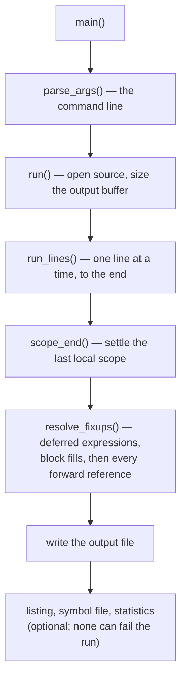
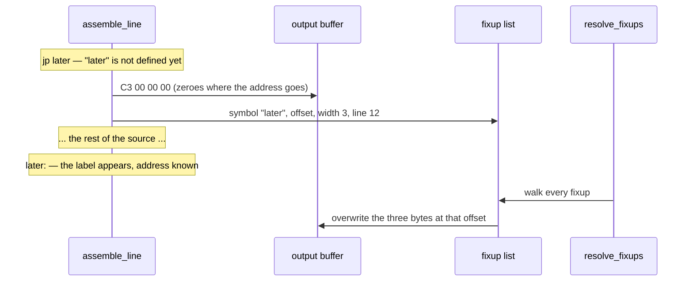
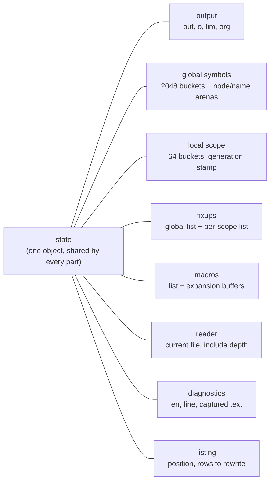
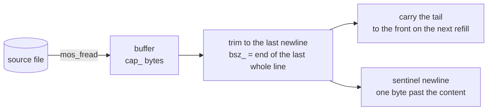
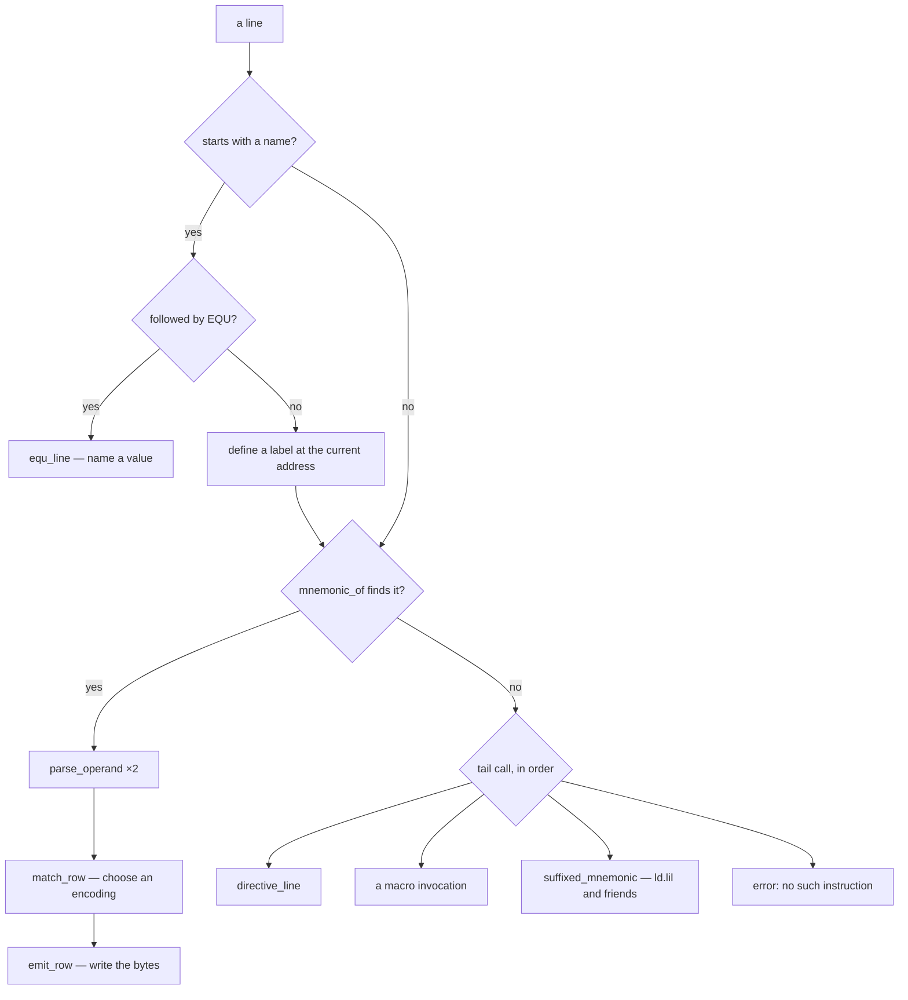
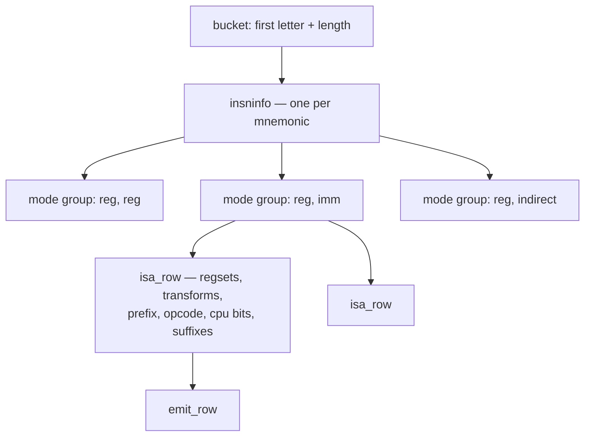
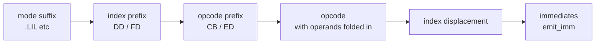
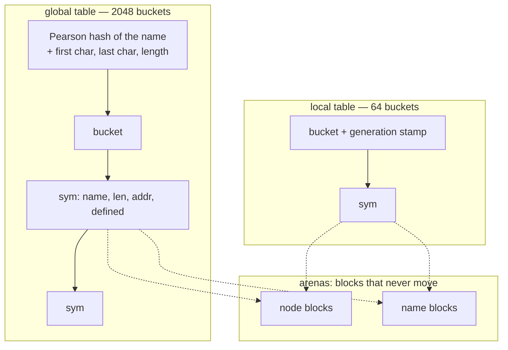
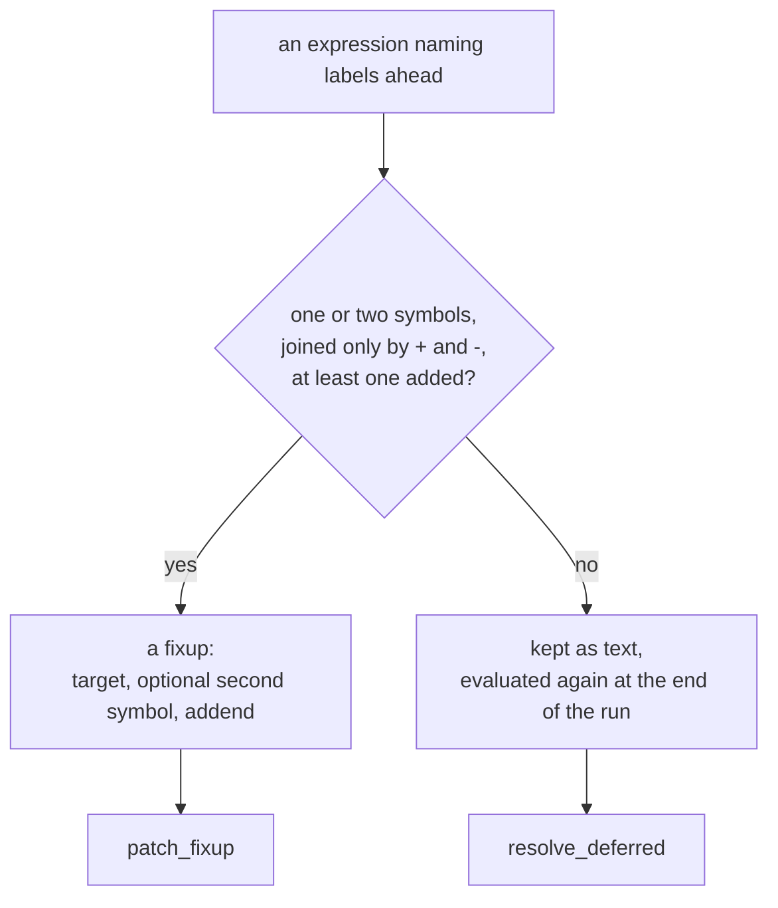
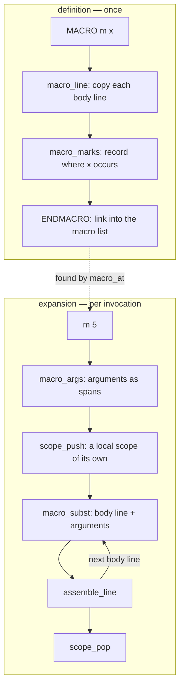

# How zap works

zap assembles eZ80 source into a binary in **one pass**, on a machine with
**512 KB of RAM and no cache**. Those two facts explain most of the design;
this document describes the parts and how they fit together.

The assembler is seven files. Each has a header holding what the other parts
need from it, and the sections below follow them:

| file | what is in it | sections |
|---|---|---|
| [`zap.c`](../src/zap.c) | the line loop, listing, reporting, the command line, `main` | 1, 11, 12 |
| [`scan.c`](../src/scan.c) | character classes, tokens, registers | 4 |
| [`insn.c`](../src/insn.c) | mnemonic tables, row selection, emitting | 5, 6 |
| [`symtab.c`](../src/symtab.c) | symbols, interning, local labels, fixups | 7 |
| [`expr.c`](../src/expr.c) | expressions, forward references, `EQU` | 8 |
| [`directive.c`](../src/directive.c) | directives, and the output buffer | 9 |
| [`macro.c`](../src/macro.c) | definition and expansion | 10 |

[`zap.h`](../src/zap.h) holds what all of them share: the types, the state, the
constants that size it, and one declaration per symbol a part offers the
others. The instruction table is generated into
[`src/isa_table.c`](../src/isa_table.c); the buffered reader, the number parser
and the character conversions are small units of their own.

The hot path crosses those boundaries on purpose. `assemble_line` has the
operand parser, the row match and the emitter inlined into it, and a compiler
inlines only what it can see — so the twenty functions in that position have
their bodies in `<part>.h` rather than `<part>.c`. Nothing else does; rule 5 in
section 14 is the long version.

Links in this document point at the definition of the thing being described,
which for those twenty is the header.

---

## 1. The shape of a run



[`main()`](../src/zap.c#L1415) ·
[`parse_args()`](../src/zap.c#L756) ·
[`run()`](../src/zap.c#L481) ·
[`run_lines()`](../src/zap.c#L343) ·
[`scope_end()`](../src/symtab.c#L700) ·
[`resolve_fixups()`](../src/zap.c#L319)

There is no intermediate representation and no syntax tree. A line is read,
turned into bytes, and forgotten. What survives a line is only what a later
line might need: the symbols it defined, the fixups it left behind, and the
bytes themselves.

---

## 2. One pass, and what it costs

A reference to a label further down the file cannot be resolved where it is
read. A two-pass assembler reads the source twice; zap reads it once and
**patches the output afterwards**.



The fixup carries the line number as well as the offset, so a failure found at
patch time — an unknown label, a jump out of range, a value that does not fit —
is reported against the line that *used* the label rather than wherever the
patching happened to be.

The price is that the whole output has to be in memory at once. On a 512 KB
machine that bounds what can be assembled, and it is the trade the design
makes: memory instead of a second pass over the source.

Three kinds of thing wait for the end of the run:

| | resolved by | holds |
|---|---|---|
| fixup | [`patch_fixup()`](../src/symtab.c#L565) | one or two symbols, an addend, a width, an offset |
| deferred expression | [`resolve_deferred()`](../src/zap.c#L262) | expression text a fixup cannot represent |
| deferred fill | [`resolve_fills()`](../src/zap.c#L286) | a `BLK` whose fill value was not known yet |

A [`fixup`](../src/zap.h#L651)'s width is normally a byte count, 1 to 4, or 0
for a relative displacement. Three values above those mean the operand belongs
in the **opcode byte itself** rather than after it — a bit number, an interrupt
mode, a restart address — so `bit n, a` with `n` defined later still assembles
correctly.

---

## 3. The state

Everything the assembler knows lives in one object,
[`state`](../src/symtab.c#L228), of type
[`zap_state`](../src/zap.h#L1004). It is defined in `symtab.c` and declared in
`zap.h`, so every part reaches the same one.



A file-scope object is addressed absolutely on the eZ80: the address of a field
is a constant written into the instruction. Reached through a pointer parameter
instead, every access would first load that pointer out of the frame.

The consequence is that **one process assembles one source**. A library API
able to assemble two would have to pass this around again.

Field order inside the struct is deliberate. The fields a line touches — the
cursor, the line number, the error code — are near the front, and the bulky,
rarely-read ones (the 256-byte local bucket array, the include path) are at the
end, so that a displacement from a base register reaches the hot ones.

---

## 4. Reading the source

[`buf_reader`](../src/buf_reader.h#L42) hands out **whole lines**. It reads a
buffer, trims the read back to the last newline in it, and carries the partial
line at the end forward to the front of the next buffer.



Two consequences the rest of the assembler relies on:

* a token can point straight into the buffer, because a refill only ever
  happens at a line boundary;
* there is always a newline one byte past the content — the **sentinel** — so
  every scan terminates on it without testing the end.

[`include_file()`](../src/directive.c#L591) opens a second reader and re-enters the same
line loop; the parent's reader is saved in the include's own stack frame. The
parent's file handle is closed while the child runs and reopened afterwards,
seeking back to where the parent had reached, because MOS has few handles.

---

## 5. Assembling a line

[`assemble_line()`](../src/zap.c#L26) is the hot path, and everything it
needs is inlined into it: the label parser, the mnemonic lookup, the operand
parser, the row matcher and the emitter. A line is examined once, left to
right.



[`equ_line()`](../src/expr.c#L583) ·
[`mnemonic_of()`](../src/insn.h#L87) ·
[`parse_operand()`](../src/expr.h#L74) ·
[`match_row()`](../src/insn.h#L150) ·
[`emit_row()`](../src/insn.h#L327) ·
[`directive_line()`](../src/directive.c#L793) ·
[`suffixed_mnemonic()`](../src/insn.c#L569) ·
[`third_operand()`](../src/insn.c#L660)

* **The mnemonic lookup** buckets by first letter *and* length, so it compares
  one or two candidates rather than five, and never measures a length at run
  time.
* **Operands** are parsed into a fixed 21-byte [`dop`](../src/zap.h#L247): a
  register-set bitmask in three byte-wide planes, a mode (register, indirect,
  immediate, indirect-immediate), an immediate, a displacement, and any forward
  reference the operand is carrying.
* Everything that is not an instruction is reached by a **tail call** from the
  point where the mnemonic lookup failed, so an ordinary instruction never
  tests for any of it.

---

## 6. Selecting an instruction

[`src/isa_table.c`](../src/isa_table.c) holds the whole instruction set,
transcribed mechanically from the reference assembler by
[`tools/gen_isa.py`](../tools/gen_isa.py). It is arranged in three levels.



* An [`isa_row`](../src/isa.h#L105) says what the two operands must be, how each
  folds into the opcode, the prefix and opcode bytes, which CPUs have it, and
  which mode suffixes it accepts.
* A **mode group** collects the rows of one mnemonic that expect the same
  operand shapes, so a group whose shape does not match is rejected once rather
  than row by row. The four mnemonics that take condition codes — `call`,
  `jp`, `jr`, `ret` — are left ungrouped, because a condition code can arrive
  in a shape the group test would reject.
* [`match_row()`](../src/insn.h#L150) tests operand A first and reaches B only
  if A survives. Most rejections are rows of the right shape with the wrong
  registers.

Once a row is chosen, [`emit_row()`](../src/insn.h#L327) writes the bytes in
this order:



`bit n, (ix+d)` is the one shape where the displacement comes *before* the
opcode.

**`.CPU`** selects an instruction set by masking rows: the Z80 set includes the
undocumented instructions, and neither the Z80 nor the Z180 has ADL or mode
suffixes.

---

## 7. Symbols

Three kinds, in two tables.



**Global labels and EQU values** ([`sym`](../src/zap.h#L198),
[`sym_intern()`](../src/symtab.c#L407)) are **interned on first sight**, defined
or not, so a reference to a label that has not appeared yet gets an entry and a
fixup points at it. Nodes and names come from arenas of blocks that never move:
a growing array would have to be reallocated, and a realloc that moves holds
both copies at once.

**Local labels** (`@name`, [`loc_intern()`](../src/symtab.c#L763)) belong to the
global label above them. A scope ends at the next global label — thousands of
times in a real source — so it must empty in constant time. Each slot carries
the generation it belongs to: advancing the counter in
[`scope_end()`](../src/symtab.c#L700) makes every bucket read as empty, whatever
chain it still holds.

**Anonymous labels** (`@@`, referred to as `@f` and `@b`) are not table entries
at all. [`anon_define()`](../src/symtab.h#L30) keeps the address of the last
`@@` for `@b`, and one nameless symbol that every `@f` since the last `@@`
waits on, settled the moment the next `@@` appears.

When a scope ends, its local fixups are patched, and any fixup naming a global
*and* a local has the local half folded into its addend there and then — the
local's node is about to be recycled.

---

## 8. Expressions

Most operands never reach the evaluator: a register, a plain literal
([`lit_value()`](../src/directive.h#L27)) and a bare name each have a reader of
their own. What does reach it is a precedence climb
([`expr_value()`](../src/expr.c#L524),
[`expr_atom()`](../src/expr.c#L190)) over `+ - * / << >> & | ^` with unary `-`
and `~`, grouped with `[...]` because parentheses already mean indirection.

Two things make it unusual:

* **Two binding-power tables.** Under `-ez80` every operator binds equally, and
  a precedence climb in which everything binds equally is exactly the
  left-to-right fold the reference performs. The compatible behaviour falls out
  of the same code.
* **The evaluator is 32 bits wide** where the machine's word is 24. `DW32` and
  `BLKL` are four bytes, and the reference evaluates in 32 bits; truncation
  happens at the emitter, on the width the directive asked for. The fast
  readers stay in the machine's word and hand anything wider to `num_parse`, so
  the extra width is not paid on the common path.

While an expression is evaluated, the labels it names that are still undefined
are tracked with their signs, and what happens next depends on the shape:



---

## 9. Directives

Reached only after the mnemonic lookup has failed, and dispatched by
[`directive_of()`](../src/directive.c#L106) — a switch on the token's length and
characters rather than a table — then handled in
[`directive_line()`](../src/directive.c#L793).

| group | directives |
|---|---|
| data | `DB` `DW` `DL` `DW24` `DW32` `ASCIZ` (and the `DEFB`/`BYTE`/`ASCII` spellings) |
| space | `DS` `BLKB` `BLKW` `BLKP` `BLKL` `ALIGN` `FILLBYTE` |
| address | `ORG` `.RELOCATE` `.ENDRELOCATE` `ASSUME ADL=` |
| symbols | `EQU` |
| files | `INCLUDE` `INCBIN` |
| conditional | `IF` `ELSE` `ENDIF` |
| macros | `MACRO` `ENDMACRO` |
| target | `.CPU` |

Two distinctions in this group are easy to get wrong and worth stating:

* **`DS` reserves ([`emit_fill()`](../src/directive.c#L405)), `BLK` emits
  ([`emit_block()`](../src/directive.c#L439)).** Reserved space that reaches the end
  of the file with nothing after it is not written at all; a block always is.
  `FILLBYTE` sets what a reservation is filled with.
* **`ORG` is two directives sharing a name.** The first in a file moves the
  origin; every later one pads out to its address.

The conditional directives are ordered in the enum so that a line inside a
switched-off branch can decide what to do with a single comparison: everything
at or above `IF` is still handled while skipping, everything below it is
skipped.

---

## 10. Macros

A definition captures the body **as text** and finds the places its parameters
occur *once*, when the body is read. Each occurrence is a
[`macmark`](../src/zap.h#L331): an offset into the body, a parameter number and
a length.



[`macro_expand()`](../src/macro.c#L507) ·
[`macro_args()`](../src/macro.c#L358) ·
[`macro_subst()`](../src/macro.c#L421) ·
[`scope_push()`](../src/expr.c#L689)

There is no reader and no nested line loop for an expansion: the body is
already a run of lines. Substitution is textual and by whole identifier, which
is what the reference does — with `x` bound to `1+1`, `db 10-x` is ten there,
not eight.

Nesting is bounded at eight levels — the same bound as `INCLUDE` — and each
level has its own substitution buffer, kept and grown between invocations
rather than allocated per expansion.

---

## 11. Diagnostics

Errors are **codes**, not strings: `state.err` is a
[`zap_err`](../src/zap.h#L473), and the message text lives in
[one table](../src/symtab.c#L23) beside the enum. A caller other than `main` can
branch on the code, which is what makes the assembler usable as a library.

Everything a report needs is **captured at the moment of failure and never
maintained in advance**, so a source that assembles cleanly pays nothing:


[`err_line()`](../src/symtab.c#L238) ·
[`err_tok()`](../src/symtab.h#L47) ·
[`report()`](../src/zap.c#L1376)

```
Macro [mos_call] in "kernel.s" line 12 - unknown label 'MOS_SYSVARS'
  ld a, MOS_SYSVARS
Invoked from "main.s" line 84 as
  mos_call MOS_SYSVARS
```

There is one warning, [`warn_trunc()`](../src/zap.c#L1338), for a value too
large for the space it is written into. It is the only diagnostic that asks a
question of every value in every source rather than doing work after something
has gone wrong, so it is behind `-w`.

---

## 12. Listing and sidecars

`-l` and `-d` write a listing in the reference's columns — address, up to four
bytes per row, line number, and the source line as written — through
[`list_line()`](../src/zap.c#L941) and [`list_out()`](../src/zap.c#L923). A
macro expansion is listed as the reference lists it: the invocation with no
bytes, the arguments, then a row per body line tagged with its depth.

A line holding a forward reference is listed before that reference is patched,
so those lines are remembered by [`lstfix_add()`](../src/zap.c#L1013) and their
byte columns written again from the finished output by
[`lstfix_apply()`](../src/zap.c#L1046) before the file is closed. The console
listing cannot be given that treatment and shows the bytes as they were
emitted.

[`write_symbols()`](../src/zap.c#L1213) writes the global symbols sorted, in
the reference's format. [`write_stats()`](../src/zap.c#L1279) prints what the
run used. None of the three can fail an assembly: the output file is already
written when they run.

---

## 13. Compatibility

Byte-for-byte agreement with `ez80asm` is the point of the project, so where
the reference does something surprising, `-ez80` reproduces it rather than
being right and incompatible: no operator precedence, `IF a == b` discarding
the comparison, `0bh` read as hex.

Four differences are deliberate and permanent, each argued in
`docs/DESIGN.md`: a negative reservation (which the reference turns
into gigabytes of output), a `FILLBYTE` that would retroactively change a
reservation already written, `@local - global` with both still ahead, and
substituting a macro parameter inside a longer identifier.

`-w` is zap's own flag, and the truncation check being off by default is the
one place the two command lines mean different things.

---

## 14. What the target imposes

The eZ80 shapes this code more than any other single factor. Five rules run
through the whole of it:

1. **Ordinary C becomes library calls.** A 24-bit AND, a multiply, a variable
   shift, a signed comparison — each is a call, not an instruction. Byte
   quantities, powers of two and unsigned compares avoid them.
2. **A stack frame must stay under 128 bytes.** A frame displacement is a
   signed byte; past that, every access needs a computed address. Adding three
   bytes to `assemble_line`'s frame is measurable in the whole program. (The
   optimization guide's [section 0](../ez80_advanced_optimization_guide.md)
   defines the terms in this list, frames and spills among them.)
3. **A `static inline` helper is inlined at the compiler's discretion**, and
   one cold caller can take that away from every hot one. The helpers on the
   hot path carry `always_inline` for that reason.
4. **Every character scan carries its bound.** Without it the compiler may
   rotate the loop so that the first character is never examined — correct on
   the host, wrong on the target. [`test/run.sh`](../test/run.sh) checks the
   source for it.
5. **A function inlined across a file boundary needs its body in a header.**
   There is no link-time optimisation here: a compiler given a declaration
   emits a call. The twenty functions folded into `assemble_line` are
   therefore defined in `<part>.h`. Left in `<part>.c` they measured 3% on
   bbcbasic, which is what that rule is worth.

[`ez80_advanced_optimization_guide.md`](../ez80_advanced_optimization_guide.md)
is the long form, with the measurements behind each rule.

---

## 15. How it is checked

| | |
|---|---|
| [`test/run.sh`](../test/run.sh) | unit and CLI tests, and every source in `test/cases` assembled by both zap and the vendored reference and compared byte for byte |
| [`test/corpus.sh`](../test/corpus.sh) | the reference's own 507-source corpus plus zap's regression sources, the same way |
| [`test/bench/bench.sh`](../test/bench/bench.sh) | throughput against ez80asm on the emulator |
| [`test/bench/corpus-target.sh`](../test/bench/corpus-target.sh) | per-source speedups over the whole corpus, on the Agon |

The rule the project runs on is that **the reference is the oracle**: a
question about what zap should do is answered by assembling the case with
`ez80asm` and reading the bytes, not by reasoning about what an assembler ought
to do.

---

## 16. Adding something

* **An instruction form** belongs in the generator,
  [`tools/gen_isa.py`](../tools/gen_isa.py), not in the generated table.
* **A directive** needs a `DIR_` constant, a spelling in
  [`directive_of()`](../src/directive.c#L106), a case in
  [`directive_line()`](../src/directive.c#L793), a case file under `test/cases`
  compared against the reference, and a row in the README's directive table.
* **A diagnostic** needs a [`zap_err`](../src/zap.h#L473) code and one line in
  the message table. The static assert on the table size catches a code with no
  text.
* Anything that touches the hot path should be measured on the Agon before and
  after. The host does not predict the target: the same change can read 0.71x
  on a desktop and 0.98x on the machine this is for.
